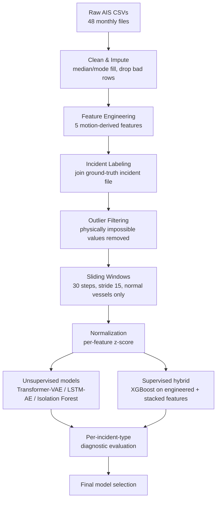

<div align="center">

# 🚢 Maritime Anomaly Detection System

**Detecting suspicious vessel behavior in Hawaii's coastal waters using deep learning, tree-based models, and a supervised hybrid pipeline — trained on 88.7M real AIS records with ground-truth incident labels.**


</div>

---

## 📋 Table of Contents

- [Overview](#-overview)
- [The Problem](#-the-problem)
- [Dataset](#-dataset)
- [Pipeline](#-pipeline)
- [Feature Engineering](#-feature-engineering)
- [Models](#-models)
- [Results](#-results)
- [Key Findings](#-key-findings)
- [Repository Structure](#-repository-structure)
- [Installation](#-installation)
- [Roadmap](#-roadmap)
- [Known Limitations](#-known-limitations)
- [References](#-references)

---

## 🎯 Overview

This project builds an end-to-end anomaly detection system for maritime traffic: it learns what "normal" vessel movement looks like from historical AIS (Automatic Identification System) data, then flags deviations that may indicate collisions, groundings, loss of power, illegal activity, or other incidents.

Four modeling approaches were built and rigorously compared — not just trained once and reported, but diagnosed per incident type, cross-validated, and stress-tested with a negative-result ablation. The strongest model is a **supervised XGBoost hybrid** that stacks reconstruction-error signals from two unsupervised deep models on top of engineered kinematic and vessel-relative features.

| | |
|---|---|
| **Data** | 88.7M AIS records · 2,622 vessels · 2017–2020 |
| **Labeled incidents** | 208 tracks / 154 real-world events across 31 incident types |
| **Best model** | XGBoost Hybrid — **AUC 0.856**, AP 0.188 (pooled grouped 5-fold CV) |
| **Status** | Model development & diagnostics complete → MLOps pipeline pending |

---

## 🌊 The Problem

Thousands of vessels move through Hawaii's waters daily. Manual monitoring doesn't scale, rule-based systems miss novel anomalies, and static models degrade as traffic patterns shift. Incident types of interest include:

- 🎣 Illegal fishing in protected marine reserves
- 💥 Collisions and groundings
- ⚓ Loss of power / loss of steering / irregular tow
- 🧭 Route deviation
- 📡 AIS spoofing or dropout

**Goal:** an automated system that learns normal shipping patterns, detects anomalies in near real-time, and can eventually retrain itself as patterns change.

---

## 📊 Dataset

**Source:** HawaiiCoast_GT — the first public AIS dataset with real-world labeled anomalies (NOAA Marine Cadastre raw AIS).

| Property | Value |
|---|---|
| Time span | 2017 – 2020 (4 years, 48 monthly files) |
| Records | ~88.7 million |
| Unique vessels | 2,622 |
| Labeled incident tracks | 208 (154 unique events) |
| Incident rate | ~0.3% of rows — highly imbalanced |
| Incident type count | 31 categories |

<details>
<summary><b>Top incident categories</b></summary>

| Incident Type | Count |
|---|---|
| Irregular tow | 76 |
| Others (various) | 73 |
| Loss of propulsion | 33 |
| Loss of steering | 10 |
| Route deviation | 8 |
| Collision | 4 |
| Grounding | 4 |

Five categories alone — *Irregular tow, Loss/reduction of propulsion, Route deviation, Material failure, Loss of power* — account for **~67% of all positive windows**, and are also the hardest for kinematic-only models to detect (see [Key Findings](#-key-findings)).
</details>

---

## ⚙️ Pipeline



**Key design decisions:**
- Only vessels with **zero** incident history are used to build training sequences — the model learns exclusively from normal behavior.
- Outlier bounds enforced before sequencing: speed ∈ [0, 60] kt, acceleration ∈ [-5, 5] kt/s, heading change ∈ [0, 180]°, Δt ≥ 1s.
- Normalization stats (`mean`/`std`) are computed once on the training set and reused for all test-time scoring.

---

## 🧩 Feature Engineering

**5 motion features** derived per vessel, in chronological order:

| Feature | Formula | Captures |
|---|---|---|
| `delta_time_sec` | `t_i - t_{i-1}` | AIS reporting gaps / dropout |
| `delta_distance_km` | Haversine(pos_i, pos_{i-1}) | Distance covered between pings |
| `computed_speed_knots` | `delta_distance_km / (Δt/3600) / 1.852` | Cross-check on reported SOG |
| `acceleration_knots_per_sec` | `(speed_i - speed_{i-1}) / Δt` | Sudden speed change (e.g. engine failure) |
| `heading_change_deg` | min angular diff of course | Sharp turns / evasive maneuvers |

Combined with raw `lat`, `lon`, `speed_over_ground_knots`, `course_over_ground_deg` → **7 features per timestep**, windowed into sequences of **30 steps** (stride 15) → **3,641,367** training sequences (2017–2019).

The **XGBoost hybrid** goes further, adding 55 total features:
- Window-level aggregates (mean/std/min/max) over the 7 kinematic channels
- AIS reporting-gap statistics
- Static vessel attributes (type, length, width)
- **Per-vessel baseline z-scores** — each vessel's own historical mean/std, so a window is judged against *that vessel's* normal, not the fleet average
- **Corridor deviation** — distance from a vessel's own typical lat/lon centroid
- Transformer-VAE and LSTM-AE **per-channel reconstruction error**, stacked in as learned signal

---

## 🧠 Models

| Model | Type | Notes |
|---|---|---|
| **Isolation Forest** | Unsupervised, tree-based | Flattened 210-dim window vector; tuned via grid search (`n_estimators=300`, `max_samples=256`) |
| **LSTM Autoencoder** | Unsupervised, deep | 0.48M params, reconstruction-error scoring |
| **Transformer-VAE** | Unsupervised, deep | 6.4M params (scaled-up version); reconstruction error + KL-regularized latent space |
| **XGBoost Hybrid** | Supervised, gradient-boosted trees | 55 engineered features including stacked deep-model errors; trained on labeled incident vessels with a **grouped MMSI split** |

> ⚠️ A correctness bug was found and fixed mid-project: `TransformerVAE.forward()` sampled `z` via reparameterization even at eval time, making its reconstruction error **non-deterministic**. Fixed by scoring via `decode(mu)` directly instead of the full stochastic forward pass — this changed the reported AUC from 0.691 to a corrected, deterministic 0.705.

---

## 📈 Results

### Final Four-Way Comparison

| Model | Overall AUC | Overall AP | Strongest at |
|---|---|---|---|
| LSTM-AE | 0.631 | 0.010 | — (never top model on any category) |
| Transformer-VAE | 0.705 | 0.015 | Flooding, Grounding, Helper tow |
| Isolation Forest | 0.764 | 0.018 | Loss of power (0.881), Container loss (0.943) |
| **XGBoost Hybrid** | **0.856** | **0.188** | Majority — 16 of 31 categories |

**XGBoost Hybrid cross-validation (grouped 5-fold by vessel, 145 incident vessels):**

| Fold | AUC | AP |
|---|---|---|
| 1 | 0.858 | 0.183 |
| 2 | 0.918 | 0.326 |
| 3 | 0.839 | 0.168 |
| 4 | 0.842 | 0.238 |
| 5 | 0.851 | 0.150 |
| **Mean** | **0.861 ± 0.029** | — |
| **Pooled (all vessels)** | **0.856** | **0.188** |

No single model wins everywhere: XGBoost wins the majority of categories, Isolation Forest specializes in outlier-shaped anomalies (power loss, container loss), and Transformer-VAE wins on incidents with distinctive motion signatures. LSTM-AE never wins a category outright but its error signal was still the single most important XGBoost feature (`lstm_err_acceleration`).

---

## 🔍 Key Findings

<details open>
<summary><b>1. The AUC ceiling was a feature blind spot, not a model or label problem</b></summary>

Per-incident-type diagnostics split incidents into two clear groups:
- **Well-detected (AUC 0.75–0.91):** Flooding, Grounding, Sinking, Collision, Container loss, Fire — incidents that visibly disrupt motion.
- **Poorly-detected (AUC 0.4–0.6):** Pollution, Loss of power, Material failure, Route deviation — a vessel can be leaking oil or have a failing generator while still sailing a normal-looking course.

These weak categories make up **~67% of all positive windows**, so they were the real bottleneck — not rare edge cases. No amount of retuning the Transformer or LSTM architecture would have fixed this; the 7 kinematic features simply couldn't see it.
</details>

<details>
<summary><b>2. Label noise was tested and ruled out</b></summary>

A "50% overlap" label-tightening experiment (window must be ≥15/30 points inside the incident interval) changed only **3.7%** of positive windows. Since incidents typically last far longer than a single 30-60 minute window, edge-clipping wasn't meaningfully corrupting the labels.
</details>

<details>
<summary><b>3. Stacking Isolation Forest into XGBoost didn't help (tested and rejected)</b></summary>

Hypothesis: since Isolation Forest specializes where XGBoost is weaker, adding its score as an XGBoost input feature should let the tree model absorb that specialization. Result: **no measurable improvement** (pooled AUC 0.8564 → 0.8496, mean CV AUC 0.8614 → 0.8594). Documented as a genuine negative result rather than discarded silently.
</details>

<details>
<summary><b>4. Aggregate improvement ≠ improvement everywhere</b></summary>

On `Pollution, Material failure`, Transformer-VAE (0.610) clearly beats the XGBoost Hybrid (0.392) — despite the hybrid having direct access to the Transformer's own error as a feature. A stated, disclosed limitation rather than a glossed-over detail.
</details>

---

## 📁 Repository Structure

<details>
<summary>Click to expand</summary>

```
maritime_anomaly_detection/
├── data/
│   ├── raw/                          # 48 monthly AIS CSVs
│   ├── hawaii_primary_trajectories_of_interest_2017_2020.csv
│   └── vessel_names_and_classes.csv
├── processed/
│   ├── monthly_parquet/
│   └── yearly_parquet/
├── sequences/
│   ├── X_train_full.npy / X_train_norm.npy / X_val_norm.npy
│   ├── X_normal_test_norm.npy / X_anomaly_test_norm.npy
│   ├── y_anomaly_test.npy / incident_type_anomaly_test.npy
│   └── norm_mean.npy / norm_std.npy
├── models/
│   ├── best_model_large.pt           # Transformer-VAE
│   ├── lstm_ae_best.pt               # LSTM Autoencoder
│   ├── isolation_forest.pkl
│   └── xgboost_hybrid.json
├── src/
│   ├── data_loader.py / preprocess.py / sequence_creator.py
│   ├── models.py / utils.py
├── maritime/
│   ├── processing/    # save_incident_types.py
│   ├── gaur/          # per_incident_type_auc.py (LSTM, Transformer)
│   ├── model/          # isoforest_per_type_diagnostic.py
│   └── hybrid/         # build_hybrid_features.py, add_deep_model_scores.py,
│                        # train_xgboost_hybrid.py, kfold_cv_hybrid.py, add_isoforest_score.py
├── notebooks/
├── mlflow_runs/
├── four_way_model_comparison.md      # full 31-category breakdown
├── requirements.txt
└── README.md
```
</details>

---

## 🛠 Installation

**Hardware:** GPU with 4GB+ VRAM recommended · 16GB+ RAM (32GB for full dataset) · 20GB+ free storage
**Software:** Python 3.8+, CUDA 11.x/12.x for GPU training

```bash
pip install torch torchvision torchaudio --index-url https://download.pytorch.org/whl/cu118
pip install numpy pandas scikit-learn tqdm matplotlib geopy mlflow xgboost
```

---

## 🗺 Roadmap

- [x] Data pipeline: cleaning, feature engineering, sequencing, normalization
- [x] Train Transformer-VAE, LSTM-AE, Isolation Forest
- [x] Per-incident-type diagnostic analysis
- [x] XGBoost hybrid model + grouped cross-validation
- [x] Isoforest-as-feature ablation (negative result, documented)
- [ ] Final XGBoost fit on all 145 incident vessels (deployment artifact — current model only uses 101/145)
- [ ] Package best model as a FastAPI microservice
- [ ] Containerize with Docker
- [ ] CI/CD via GitHub Actions
- [ ] Drift monitoring (Evidently AI)
- [ ] Automated retraining pipeline
- [ ] **Vessel profile store** — the hybrid model's per-vessel baseline features require stateful serving, not just a stateless scorer; this changes the deployment architecture, not just the loaded model file

---

## ⚠️ Known Limitations

- **`Pollution, Material failure`** remains near-or-below random across all models (best: Transformer-VAE at 0.610). Likely requires data outside AIS trajectories (sensor telemetry, port authority reports) — treated as a dataset/scope limitation, not something to keep chasing with more feature engineering.
- The XGBoost Hybrid's evaluation protocol (pooled grouped 5-fold CV) differs structurally from the fixed train/test split used for the other three models. Both are leakage-free, but not perfectly matched — stated explicitly rather than hidden.
- Only 145 incident-containing vessels exist in total, limiting how much can be learned about rare incident types even with careful grouped CV.

---

## 📚 References

1. [HawaiiCoast_GT Dataset](https://zenodo.org/records/8253611)
2. [Transformer-VAE for Anomaly Detection](https://arxiv.org/abs/2104.13312)
3. [LSTM Autoencoder for Time Series Anomaly Detection](https://arxiv.org/abs/1703.10705)
4. [Isolation Forest for Anomaly Detection](https://ieeexplore.ieee.org/document/4781136)
5. [AIS Data — NOAA Marine Cadastre](https://marinecadastre.gov/ais/)

---

<div align="center">

*This project is for educational and research purposes.*

</div>
