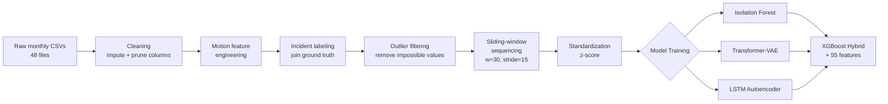
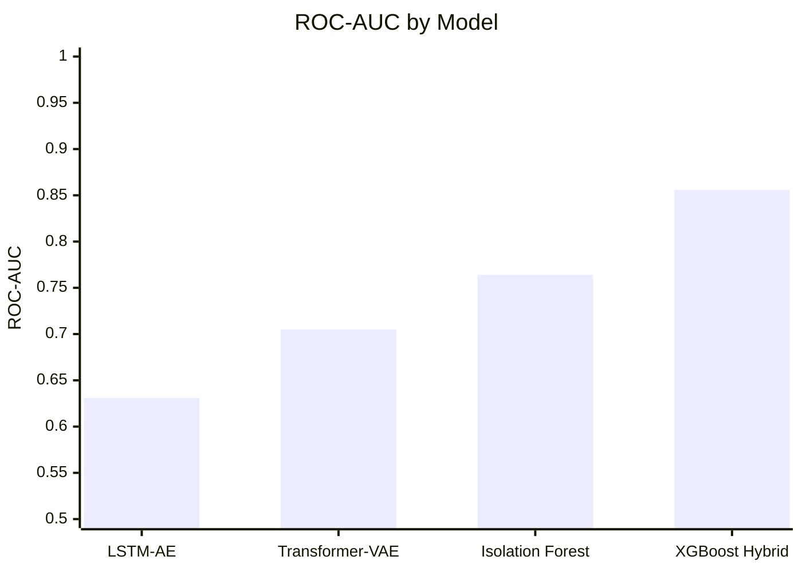

<div align="center">

# 🚢 Maritime Anomaly Detection System

**Detecting anomalous vessel behavior in Hawaiian coastal waters from AIS data** — unsupervised deep learning vs. classical outlier detection vs. a supervised hybrid, driven by a diagnostic that traces the performance ceiling to its actual root cause instead of assuming it away.

[](https://www.python.org/)
[](https://pytorch.org/)
[](https://xgboost.readthedocs.io/)
[](#results)
[](#license)

</div>

---

<details open>
<summary><b>📑 Table of Contents</b></summary>

- [Overview](#overview)
- [Dataset](#dataset)
- [Pipeline](#pipeline)
- [Models](#models)
- [Results](#results)
- [Key Finding: The Feature Blind Spot](#key-finding-the-feature-blind-spot)
- [XGBoost Hybrid Model](#xgboost-hybrid-model)
- [Known Limitations](#known-limitations)
- [Project Structure](#project-structure)
- [Setup](#setup)
- [Roadmap](#roadmap)

</details>

---

## Overview

Thousands of vessels move through Hawaiian waters every day. Manual monitoring doesn't scale, and rule-based flagging misses novel patterns. This project learns what "normal" vessel movement looks like from historical AIS (Automatic Identification System) data, then flags deviations — collisions, groundings, loss of propulsion, route deviations, and more — using both reconstruction-based anomaly detection and a supervised classifier.

Rather than stopping at "here's a model with X AUC," the project's core contribution is a **per-incident-type diagnostic** that identifies *why* every unsupervised model plateaus around 0.6–0.76 AUC, and a **feature-engineering response** that closes most of that gap.

<div align="center">

| 📊 Records | 🚤 Vessels | 🏷️ Incidents | 📈 Best AUC | 🎯 Best AP |
|:---:|:---:|:---:|:---:|:---:|
| **88.7M** | **2,622** | **208 tracks / 31 types** | **0.856** | **0.188** |

</div>

## Dataset

**HawaiiCoast_GT** — the first publicly available AIS dataset with real-world labelled anomalies.

| Property | Value |
|---|---|
| Time span | 2017 – 2020 |
| Raw AIS records | ~88.7 million |
| Unique vessels | 2,622 |
| Labelled incident tracks | 208 (154 unique events, 31 incident categories) |
| Incident rate | ~0.3% of rows — highly imbalanced |

<details>
<summary>📋 Full list of incident types included</summary>
<br>

Collision, Grounding, Irregular tow, Loss of propulsion, Loss of steering, Route deviation, Container loss, Flooding, Sinking, Fire, Pollution, Material failure, and others — 31 categories total. See <code>four_way_model_comparison.md</code> for the complete breakdown.

</details>

## Pipeline



<details>
<summary><b>🧮 Engineered motion features</b></summary>
<br>

| Feature | Formula | Captures |
|---|---|---|
| `delta_time_sec` | `t_i - t_{i-1}` | Reporting gap / possible AIS dropout |
| `delta_distance_km` | Haversine(pos_i, pos_{i-1}) | Distance travelled |
| `computed_speed_knots` | distance / time | Position-derived speed check against reported SOG |
| `acceleration_knots_per_sec` | `(v_i - v_{i-1}) / Δt` | Sudden speed change |
| `heading_change_deg` | min angular diff | Sharpness of turn |

Combined with raw `lat, lon, speed_over_ground, course_over_ground` → **7 features per timestep**, windows of **30 timesteps** (~30–60 min of movement).

</details>

Training sequences were built exclusively from vessels with **zero** incident labels, so the unsupervised models only ever learn normal behavior. Resulting training set: **3,641,367 sequences** (2017–2019).

## Models

Four approaches were trained and evaluated on a common held-out labelled test set:

1. **Isolation Forest** — flattened 30×7 windows, tree-based outlier scoring. Fast, strong baseline.
2. **Transformer-VAE** — encoder/decoder over the 30-step window, KL-annealed, reconstruction error as anomaly score. Scored deterministically by decoding from `mu` rather than sampling `z` (see [limitations](#known-limitations)).
3. **LSTM Autoencoder** — recurrent encoder-decoder, reconstruction error as anomaly score.
4. **XGBoost Hybrid** — supervised classifier over 55 engineered features, including per-vessel baseline z-scores and the deep models' own reconstruction errors as inputs.

## Results

Final, corrected numbers (see [Known Limitations](#known-limitations) for the Transformer non-determinism fix that changed its reported score):

| Model | Overall ROC-AUC | Overall AP |
|---|---|---|
| LSTM Autoencoder | 0.631 | 0.010 |
| Transformer-VAE | 0.705 | 0.015 |
| Isolation Forest | 0.764 | 0.018 |
| **XGBoost Hybrid** | **0.856** | **0.188** |



No single model dominates every incident type — XGBoost wins 16/31 categories, Isolation Forest wins 7 (concentrated on Loss of power / Container loss), Transformer wins 8 (Flooding, Grounding, Helper tow), and LSTM-AE never wins outright but still contributes useful signal as an XGBoost input feature.

<details>
<summary>📄 Full 31-category per-incident-type breakdown</summary>
<br>

See <code>four_way_model_comparison.md</code> for the complete table. Summary: Isolation Forest specializes in Loss of power (0.881) and Container loss (0.943) — types that are straightforward outliers in flattened feature space. Transformer-VAE specializes in Flooding, Grounding, and Helper tow — types with strong temporal/motion signatures. XGBoost Hybrid wins the majority by combining both signal types plus supervised learning on engineered features.

</details>

## Key Finding: The Feature Blind Spot

Every unsupervised model plateaued in the same 0.6–0.76 AUC range, with no obvious explanation. Two hypotheses were tested:

- **Label noise** — tested via a 50%-overlap label-tightening experiment. Result: only 3.7% of positive windows changed. **Ruled out.**
- **Model capacity / tuning** — scaling the Transformer-VAE from 1.9M → 6.4M parameters raised AUC from 0.615 → 0.691, showing *some* headroom but not enough to explain the ceiling.

The real answer came from computing AUC **per incident type** rather than in aggregate:

- **Well-detected (AUC 0.75–0.91):** Flooding, Grounding, Sinking, Collision, Container loss, Fire — incidents that visibly disrupt motion (stopping, listing, erratic heading), which is exactly what kinematic features are built to catch.
- **Poorly-detected (AUC 0.4–0.6):** Pollution, Loss of power, Material failure, Route deviation — a vessel can be leaking oil or have a failing generator while still sailing a normal-looking course. These categories account for **~67% of all positive windows**, so they were dragging the aggregate metric down, not a handful of edge cases.

**Conclusion:** the ceiling was a *feature blind spot*, not a model or label problem. No amount of retuning would fix it — the 7 kinematic-only features structurally cannot see these incident types. This reframed the project from "tune the deep model harder" to "engineer features that carry different information."

## XGBoost Hybrid Model

Built directly in response to the diagnostic above. New feature groups added on top of the flattened kinematics:

- Window-level aggregates (mean/std/min/max) over the 7 kinematic channels
- `delta_time_sec` gap statistics — surfaces AIS reporting dropout
- Static vessel attributes (`vessel_type_code`, `length_m`, `width_m`)
- **Per-vessel baseline z-scores** — each vessel's own historical mean/std speed and heading, so incidents that look normal in aggregate but abnormal *for that specific vessel* become visible
- **Corridor deviation** — distance from a vessel's own typical lat/lon centroid
- Transformer-VAE and LSTM-AE per-channel reconstruction error, stacked in as features rather than treated as separate standalone detectors

**Methodology note:** a supervised model needs positive examples in training, so a **grouped train/val/test split by MMSI** (101/21/23 vessels) was carved out of the 145 incident-containing vessels. Grouping by vessel is mandatory here — with per-vessel baseline features in the table, a non-grouped split would let the model partially "recognize the vessel" instead of learning the incident pattern, inflating AUC via leakage.

**Validation:** single split gave AUC 0.837. Because 145 vessels is a small population, a grouped 5-fold CV was run as a mandatory stability check (every vessel in exactly one fold's test set):

<details>
<summary>📊 5-fold cross-validation results</summary>
<br>

| Fold | AUC | AP |
|---|---|---|
| 1 | 0.858 | 0.183 |
| 2 | 0.918 | 0.326 |
| 3 | 0.839 | 0.168 |
| 4 | 0.842 | 0.238 |
| 5 | 0.851 | 0.150 |

</details>

Mean AUC **0.861 ± 0.029**, pooled out-of-fold AUC **0.856** (AP 0.188) — consistent with the single split, confirming it wasn't a lucky draw.

Top feature by importance: `lstm_err_acceleration` (0.206) — more than double the next feature, validating the decision to stack the deep models' errors as inputs.

**Tested and rejected:** adding Isolation Forest's raw score as an extra XGBoost feature, hypothesizing the tree model would absorb IF's specialization on Loss-of-power/Container-loss automatically. Result: pooled AUC moved from 0.856 → 0.850, a negative result within noise — no benefit, so the feature was dropped and excluded from the final feature set. Documented as a real, tested-and-rejected hypothesis rather than silently discarded.

## Known Limitations

Stated plainly, not glossed over:

- **`Pollution, Material failure` stays near-or-below random** across every model (best: Transformer at 0.610). Likely genuinely undetectable from AIS trajectories alone — probably needs sensor telemetry or port authority reports, not more feature engineering. Treated as a dataset/scope limitation.
- **Evaluation protocols aren't perfectly matched.** The XGBoost Hybrid is evaluated via pooled grouped 5-fold CV; the other three models use a single fixed-split population (positives vs. the full clean-2020 negative pool). Both are leakage-free, but not identical protocols — this is disclosed rather than hidden.
- **The Transformer-VAE originally scored non-deterministically.** `forward()` sampled `z` via reparameterization even at eval time (`model.eval()` only disables dropout, not this sampling), so the same window scored twice gave different reconstruction errors. This explains why an early report (0.691) differed from a later re-run (0.705) on identical data/checkpoint. Fixed by scoring deterministically from `mu` (`encode(x) → decode(mu)`) instead of the stochastic `forward(x)`.
- **The deployed model isn't final yet.** The saved `xgboost_hybrid.json` was trained on only 101/145 vessels (the original single-split run used for reporting). A production artifact needs a final fit on all 145 vessels before deployment.
- **Serving architecture isn't stateless.** Unlike the three unsupervised models, the hybrid's per-vessel baseline features require a stateful vessel-profile store, not just a stateless scorer — this affects MLOps design, not just which model file gets loaded.

## Project Structure

```
maritime_anomaly_detection/
├── data/                    # Raw AIS CSVs + incident metadata
├── processed/               # Monthly & yearly parquet
├── sequences/                # Windowed .npy arrays (train/val/test, normal & anomaly)
├── models/                   # Saved model artifacts (.pth, .pt, .pkl, .json)
├── notebooks/                 # Exploration, cleaning, sequencing, evaluation
├── src/
│   ├── data_loader.py
│   ├── preprocess.py
│   ├── sequence_creator.py
│   ├── models.py
│   └── utils.py
├── maritime/
│   ├── processing/            # save_incident_types.py, path cleanup
│   ├── gaur/                  # per_incident_type_auc.py (LSTM, Transformer variants)
│   ├── hybrid/                 # build_hybrid_features.py, add_deep_model_scores.py,
│   │                            train_xgboost_hybrid.py, kfold_cv_hybrid.py,
│   │                            add_isoforest_score.py
│   └── model/                  # isoforest_per_type_diagnostic.py
├── mlflow_runs/
├── four_way_model_comparison.md   # Full 31-category per-type results
├── requirements.txt
└── README.md
```

## Setup

```bash
# GPU-enabled PyTorch (adjust CUDA version as needed)
pip install torch torchvision torchaudio --index-url https://download.pytorch.org/whl/cu118

pip install numpy pandas scikit-learn tqdm matplotlib geopy mlflow xgboost
```

**Hardware:** NVIDIA GPU with 4GB+ VRAM recommended · 16GB+ RAM (32GB for the full dataset) · 20GB+ free storage.

<details>
<summary>🛠️ Scripts reference</summary>
<br>

| Script | Location | Purpose |
|---|---|---|
| `save_incident_types.py` | `maritime/processing/` | Per-window incident type, verified against existing labels |
| `per_incident_type_auc.py` | `maritime/gaur/` | Per-type AUC/AP for LSTM-AE |
| Transformer per-type variant | `maritime/gaur/` | Per-type AUC/AP for Transformer-VAE (deterministic, mu-based) |
| `build_hybrid_features.py` | `maritime/hybrid/` | Kinematic aggregates + non-kinematic feature table |
| `add_deep_model_scores.py` | `maritime/hybrid/` | Appends Transformer/LSTM per-channel reconstruction error |
| `train_xgboost_hybrid.py` | `maritime/hybrid/` | Single grouped-split XGBoost training + evaluation |
| `kfold_cv_hybrid.py` | `maritime/hybrid/` | Grouped 5-fold CV, pooled per-type report |
| `isoforest_per_type_diagnostic.py` | `maritime/model/` | Isolation Forest grid search + per-type diagnostic |
| `add_isoforest_score.py` | `maritime/hybrid/` | IF score as XGBoost feature (tested, rejected) |

</details>

## Roadmap

- [ ] Final fit of XGBoost Hybrid on all 145 vessels for deployment
- [ ] MLOps pipeline: FastAPI microservice → Docker → CI/CD (GitHub Actions) → drift monitoring (Evidently AI) → automated retraining, including the stateful vessel-profile store the hybrid model requires
- [ ] Investigate why `trans_err_*` features barely register in XGBoost feature importance despite the Transformer outscoring the LSTM standalone (0.705 vs. 0.631) — plausibly correlated with existing kinematic aggregates, not yet confirmed

## References

1. [HawaiiCoast_GT Dataset](https://zenodo.org/records/8253611)
2. [Transformer-VAE for Anomaly Detection](https://arxiv.org/abs/2104.13312)
3. [LSTM Autoencoder for Time Series Anomaly Detection](https://arxiv.org/abs/1703.10705)
4. [Isolation Forest](https://ieeexplore.ieee.org/document/4781136)
5. [AIS Data — NOAA Marine Cadastre](https://marinecadastre.gov/ais/)

## License

Research and educational use.
